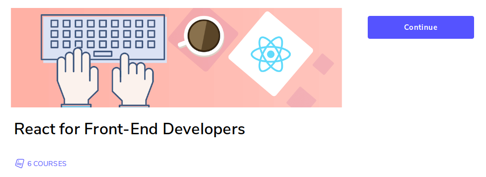

<h1 align=center>
  
</h1>

[⚛️ JavaScript Fundamentals Before Learning React](https://www.educative.io/courses/javascript-fundamentals-before-learning-react)

## Alcance Variables js

- **var** Scope dentro de la funcion que se declara.
- **let y const** dentro de `{}` bloque.

> Ya no usar var, por defecto usar const

## Renderizado condicional

[Renderizado condicional](./conditional-rendering/README.md)
